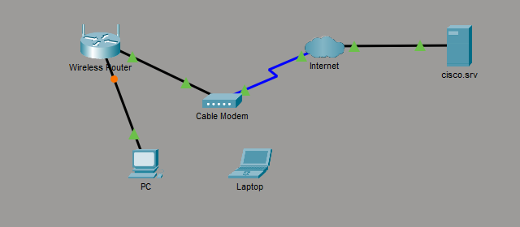
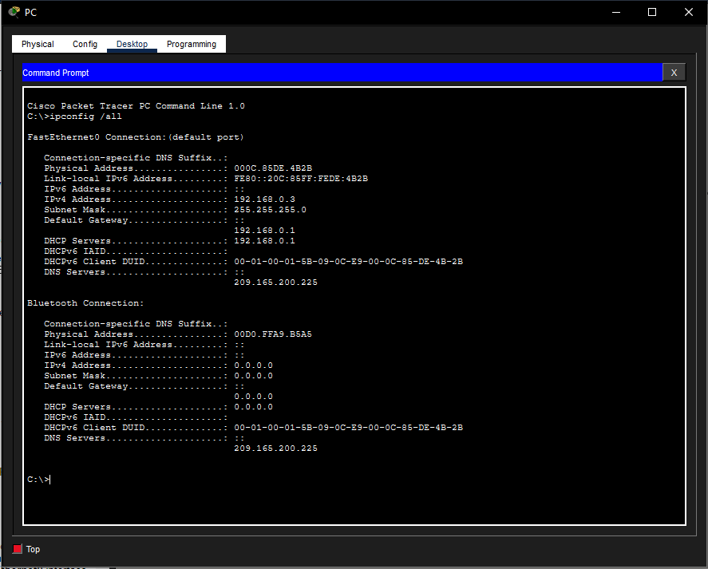
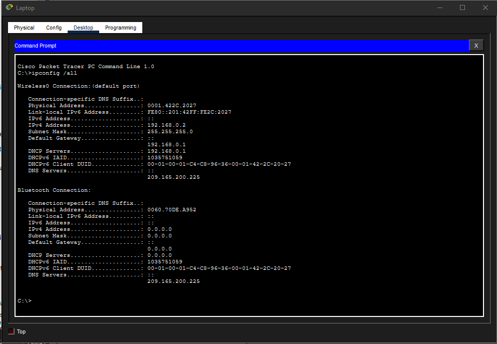

# Home Network Simulation

## Objective

Deploy and verify a small home network with wired and wireless client connectivity.

## Description

Configured a home network in Cisco Packet Tracer with a desktop PC, wireless laptop, wireless router, cable modem, and ISP connection. Set up wired and wireless client access, used DHCP for automatic IPv4 addressing, and verified connectivity with `ipconfig` and `ping`. Troubleshot DHCP lease and wireless connectivity issues until both clients could communicate through the network.

## Topology

## Network Components

- Desktop PC
- Wireless Laptop
- Wireless Router
- Cable Modem
- Internet Cloud

## Skills Demonstrated

- Cisco Packet Tracer
- Home Network Setup
- LAN Connectivity
- DHCP
- IPv4 Addressing
- Wireless Networking
- Connectivity Testing
- Network Troubleshooting
- DNS
- TCP/IP

## Tasks Performed

- Connected network devices using Ethernet and wireless connections
- Obtained IP addresses through DHCP
- Verified addressing using ipconfig
- Tested connectivity using ping
- Connected a wireless client to the network
- Troubleshot DHCP lease and connectivity issues

## Verification

The desktop PC and wireless laptop both received IPv4 addresses from DHCP and were configured with the wireless router as the default gateway.

### Desktop PC IP Configuration

### Wireless Laptop IP Configuration

## Key Concepts

- DHCP
- IPv4
- DNS
- Default Gateway
- Wireless Communication

## Lessons Learned

- DHCP allows client devices to receive IP settings automatically.
- A default gateway is required for devices to communicate outside their local network.
- Wireless clients need both the correct network settings and a successful association to the router.
- Basic tools like `ipconfig` and `ping` are useful for confirming and troubleshooting connectivity.
