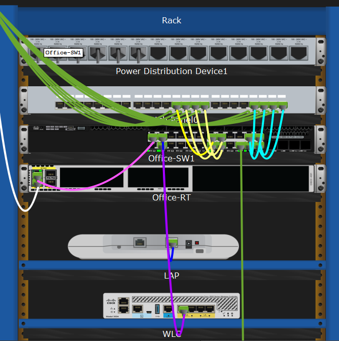
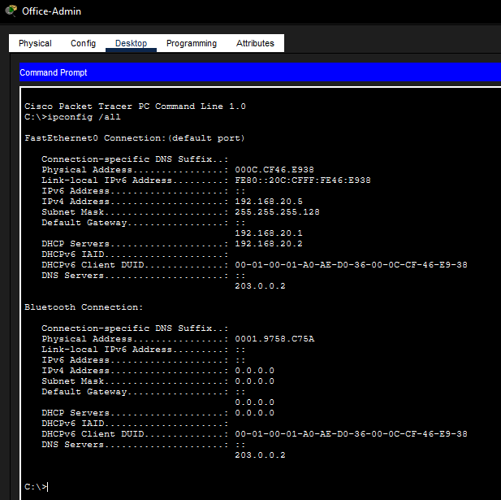
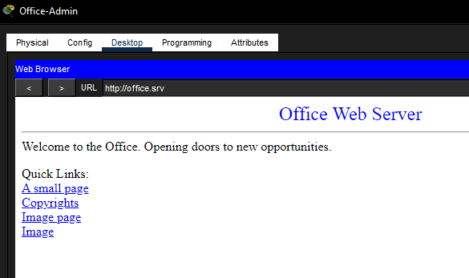
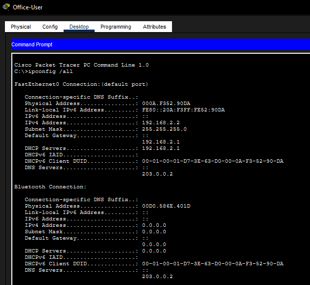
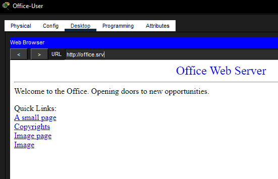

# Structured Cabling Simulation

## Objective

Create a realistic office cabling setup in Cisco Packet Tracer.

## Description

Built a small office network layout using a wiring closet, patch panel, wall mounts, switch connections, and copper cabling. I connected office devices through wall ports instead of directly cabling everything to the switch, which made the setup feel closer to how a real office network is organized.

## Topology

## Network Components

- Office-SW1
- Patch Panel0
- Wall Mount0 and Wall Mount1
- Office-Admin PC
- Office-User PC
- Printer0
- Office-Server

## Skills Demonstrated

- Cisco Packet Tracer
- Structured Cabling
- Patch Panels
- Wall Mounts
- Copper Cabling
- DHCP Verification
- LAN Connectivity Testing

## Tasks Performed

- Installed a patch panel in the wiring closet rack
- Connected switch ports to patch panel jacks
- Added wall mounts in the office
- Linked wall mount punchdowns back to the patch panel
- Connected PCs and a printer through wall jacks
- Verified DHCP addressing and access to `office.srv`
- Organized cables using rack management and bendpoints

## Verification

Both office PCs received network addressing and were able to reach the internal web server at `office.srv`.

### Equipment Cabinet

### Office-Admin IP Configuration

### Office-Admin Web Test

### Office-User IP Configuration

### Office-User Web Test

## Key Concepts

- Structured Cabling
- Wiring Closet
- Patch Panel
- Wall Ports
- DHCP
- Cable Management
