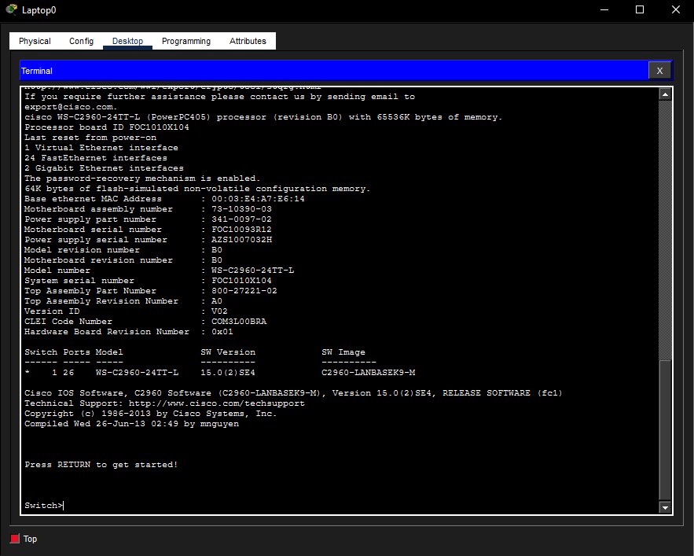
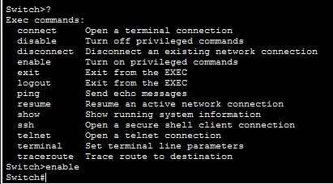
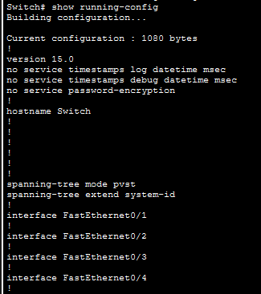
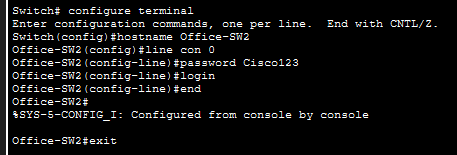

# CLI Console Configuration Simulation

## Objective

Deploy and configure a newly installed Cisco switch before adding it to a production office network.

## Description

Configured a Cisco switch using a direct console connection in Cisco Packet Tracer. Accessed the Cisco IOS command-line interface, entered privileged and global configuration modes, assigned a hostname, configured console authentication, and saved the running configuration to startup memory to ensure the settings stayed in place after reloads.

## Topology



## Network Components

- Laptop0
- Office-SW2
- Console Cable
- Terminal Application

## Skills Demonstrated

- Cisco Packet Tracer
- Cisco IOS CLI
- Switch Configuration
- Console Access
- Device Provisioning
- Configuration Management
- Network Administration Fundamentals
- Running vs Startup Configuration
- Configuration Persistence
- Basic Device Security

## Tasks Performed

- Connected to the switch using the laptop terminal
- Entered User EXEC and Privileged EXEC modes
- Used CLI help to review available commands
- Viewed the switch running configuration
- Renamed the switch to `Office-SW2`
- Configured the console password as `Cisco123`
- Tested console login after exiting the session
- Saved the running configuration to startup configuration

## Commands Used

```text
enable
configure terminal
hostname Office-SW2
line con 0
password Cisco123
login
show running-config
copy running-config startup-config
reload
```

## Verification

The switch accepted the new hostname and console password. After saving the running configuration to startup configuration, the device kept the settings and prompted for console login after reload.

### Console Startup


### CLI Help and Enable Mode



### Running Configuration



### Global Configuration Mode



### Saved Configuration


## Key Concepts

- Console Connection
- Cisco IOS
- User EXEC Mode
- Privileged EXEC Mode
- Global Configuration Mode
- Running Configuration
- Startup Configuration
- Device Hardening
- Configuration Persistence
- NVRAM vs RAM
- Device Initialization
- Console Authentication

## Lessons Learned

- Cisco devices store active settings in the running configuration in RAM.
- Unsaved configuration changes are lost after a reboot or power loss.
- Console access provides a management method even when a device has no network connectivity.
- The `copy running-config startup-config` command is critical for preserving configuration changes.
