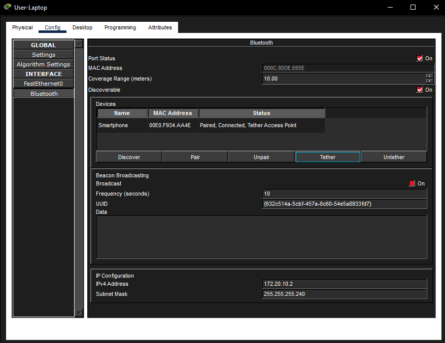
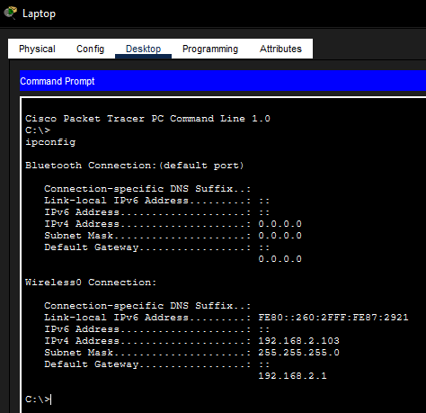
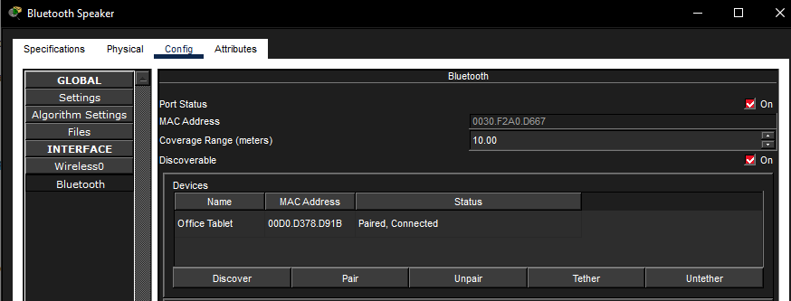
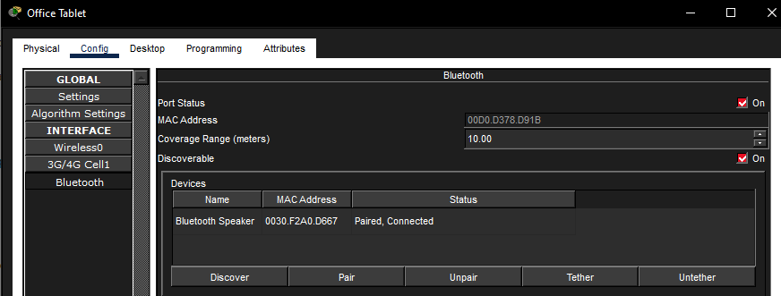

# Wireless Technologies Simulation

## Objective

Connect office devices using WLAN, Bluetooth, and cellular tethering in Cisco Packet Tracer.

## Description

Built a wireless office setup that used three different wireless technologies. I connected a laptop to the office Wi-Fi, paired a tablet with a Bluetooth speaker, and tethered a laptop through a smartphone so it could use the cellular network. This helped me practice how different wireless connections are configured and tested in Packet Tracer.

## Topology

## Network Components

- Laptop
- User-Laptop
- Smartphone
- Office Tablet
- Bluetooth Speaker
- Office WLAN
- Cellular Network
- Office-Server

## Skills Demonstrated

- Cisco Packet Tracer
- Wireless Networking
- WLAN Configuration
- Bluetooth Pairing
- Cellular Tethering
- DHCP Verification
- Web Connectivity Testing

## Tasks Performed

- Installed a wireless module in the laptop
- Connected the laptop to the `Employee` wireless network
- Verified the laptop received an IP address
- Paired the Office Tablet with a Bluetooth speaker
- Tested Bluetooth audio using the music player
- Enabled cellular tethering on the smartphone
- Connected User-Laptop to the smartphone over Bluetooth
- Verified web access to `office.srv`

## Verification

The laptop connected to the office WLAN and received network addressing. The tablet successfully paired with the Bluetooth speaker, and the User-Laptop was able to use the smartphone tethering connection to reach `office.srv`.

### Laptop IP Configuration

### Bluetooth Speaker

### Office Tablet

### Tethering Web Test

## Key Concepts

- WLAN
- SSID
- Pre-Shared Key
- Bluetooth
- Device Pairing
- Cellular Tethering
- DHCP
- Wireless Connectivity
