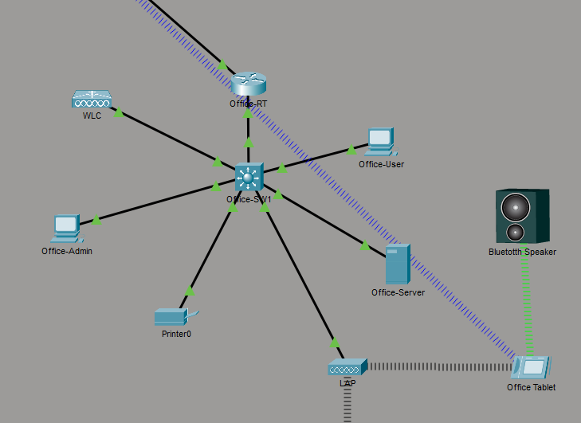
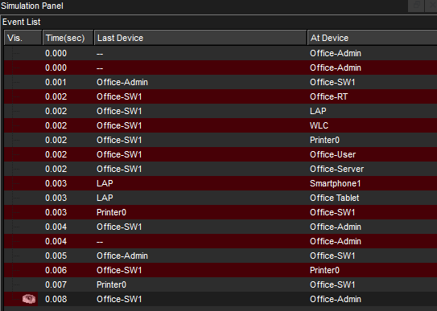
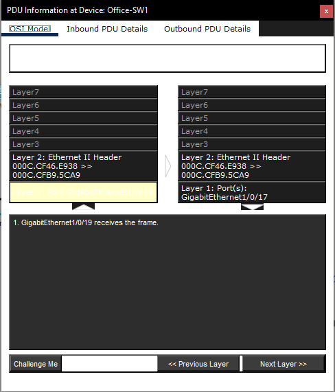
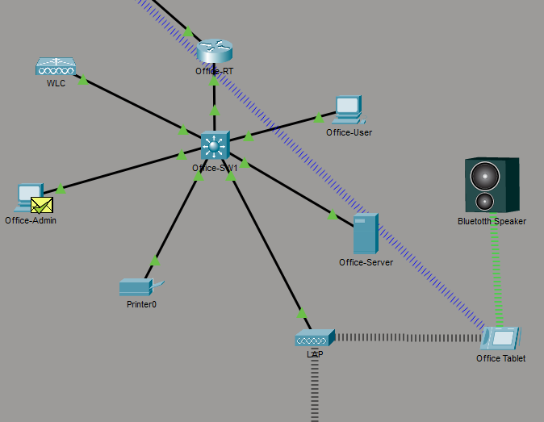
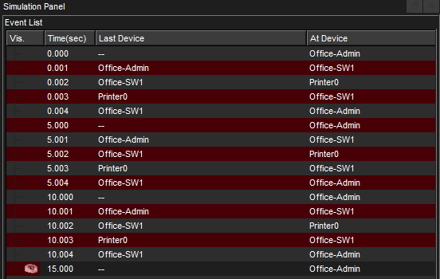

# Packet Analysis Simulation

## Objective

Analyze ICMP traffic in a small office network using Packet Tracer Simulation Mode.

## Description

Used Cisco Packet Tracer Simulation Mode to generate and inspect test traffic between office devices. Created simple and complex PDUs, observed ICMP packets moving through the network, reviewed OSI model details, and checked protocol header information to understand how traffic is built, forwarded, and returned across the LAN.

## Topology



## Network Components

- Office-Admin PC
- Printer0
- Office LAN
- Packet Tracer Simulation Mode

## Skills Demonstrated

- Cisco Packet Tracer
- Packet Analysis
- ICMP Testing
- PDU Inspection
- OSI Model Review
- IPv4 Source and Destination Addressing
- LAN Traffic Flow
- Network Troubleshooting Fundamentals

## Tasks Performed

- Created a simple PDU from `Office-Admin` to `Printer0`
- Used Capture/Forward to step through packet movement
- Reviewed ICMP events in the Simulation Event List
- Inspected PDU information at the source device
- Reviewed OSI model and outbound PDU details
- Created a complex periodic PDU
- Configured the complex PDU to send traffic every 5 seconds
- Observed repeated ICMP traffic in Simulation Mode

## Simulation Tools Used

```text
Add Simple PDU
Add Complex PDU
Capture/Forward
Simulation Event List
OSI Model tab
Outbound PDU Details tab
Periodic PDU interval: 5 seconds
```

## Verification

ICMP traffic was generated from `Office-Admin` to `Printer0` and returned successfully. The Simulation Event List showed each packet step, and the PDU details confirmed source and destination IPv4 information at the network layer.

### Simple PDU Traffic



### PDU OSI Model Details



### Complex PDU Settings



### Complex PDU Traffic



## Key Concepts

- ICMP
- PDU
- Packet Encapsulation
- OSI Model
- IPv4 Addressing
- Source and Destination Addresses
- LAN Traffic Flow
- Simulation-Based Troubleshooting

## Lessons Learned

- Simulation Mode makes it easier to see how packets move through a network step by step.
- ICMP traffic is useful for testing whether two devices can communicate.
- PDU details show how addressing and protocol information are added before traffic leaves a device.
- Complex PDUs can be used to generate repeated traffic for observation and troubleshooting.
