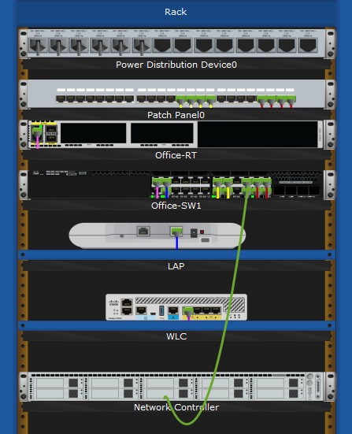
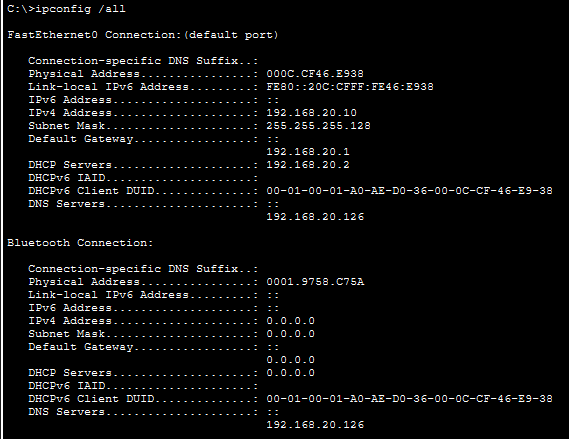
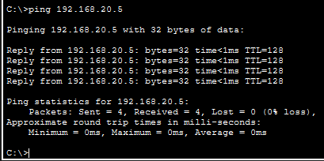
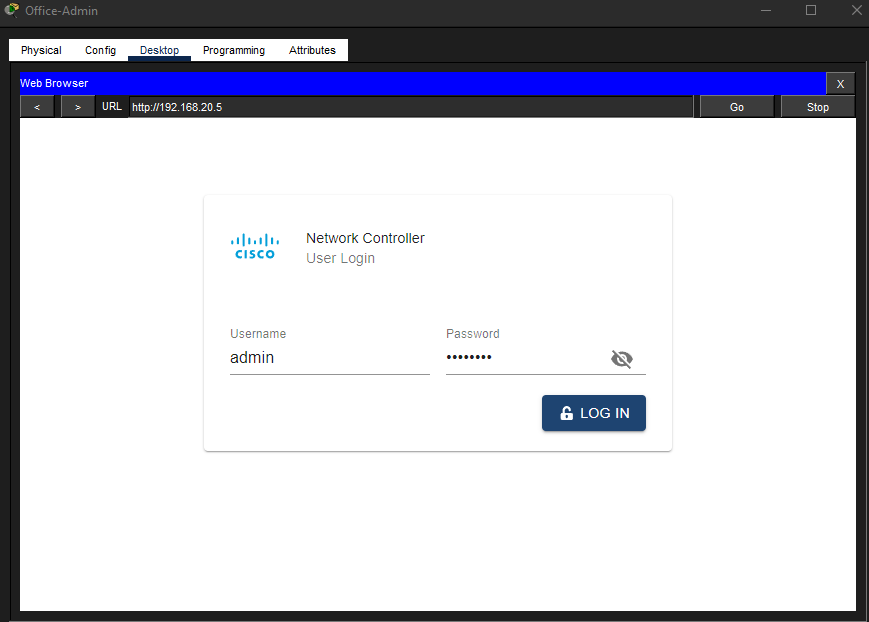
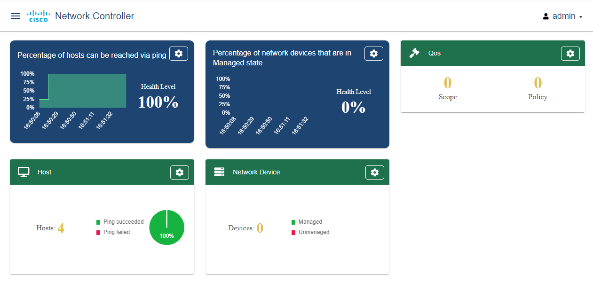
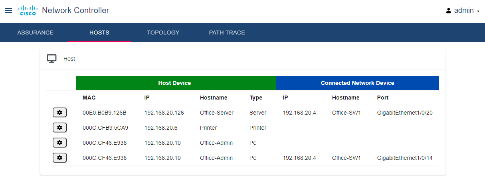
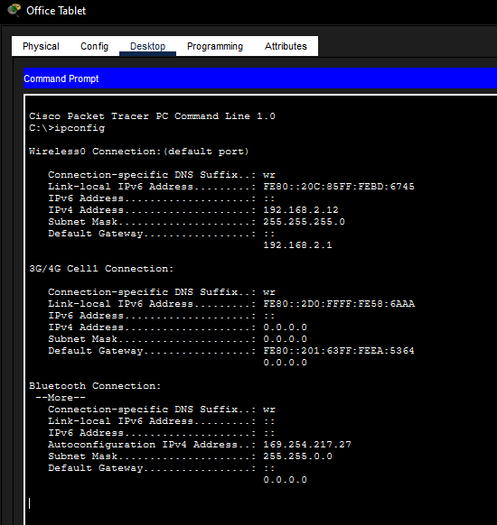
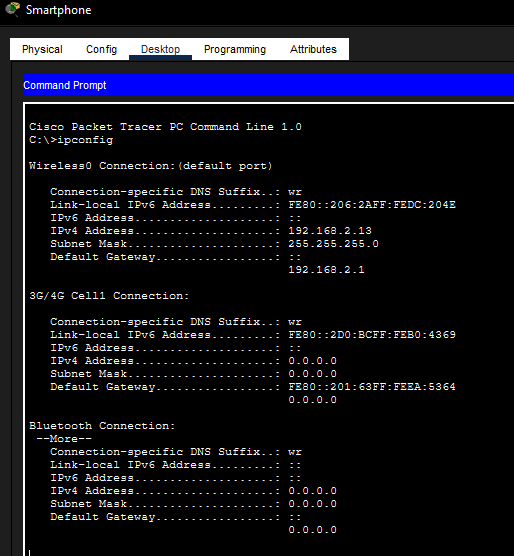

# Network Controller Monitoring Simulation

## Objective

Deploy a network controller to monitor office network devices and verify controller access from an admin workstation.

## Description

Connected a Network Controller to the office switch and verified that it was reachable from `Office-Admin` over the LAN. Accessed the controller web interface, reviewed the dashboard and host monitoring views, and confirmed that wireless devices received IP addressing from the network. This lab focused on basic network visibility, controller access, and device monitoring from an administrator workstation.

## Topology

## Network Components

- Network Controller
- Office-SW1
- Office-Admin PC
- Office Tablet
- Smartphone
- Office WLAN
- Office LAN

## Skills Demonstrated

- Cisco Packet Tracer
- Network Controller Access
- Network Monitoring
- LAN Connectivity Testing
- DHCP Verification
- Wireless Host Verification
- Web-Based Administration
- Network Administration Fundamentals

## Tasks Performed

- Installed the Network Controller in the wiring closet rack
- Connected the controller to `Office-SW1`
- Verified `Office-Admin` received an IPv4 address
- Confirmed connectivity to the controller with `ping 192.168.20.5`
- Logged in to the Network Controller web interface
- Reviewed the controller dashboard and host monitoring page
- Verified wireless IP addressing on the Office Tablet and Smartphone

## Verification

`Office-Admin` received an IP address on the office LAN and successfully reached the Network Controller at `192.168.20.5`. The controller web dashboard loaded after login, and the wireless devices received IP addresses from the network.

### Office-Admin IP Configuration

### Network Controller Ping Test

### Network Controller Login

### Network Controller Dashboard

### Assurance Hosts View

### Office Tablet IP Configuration

### Smartphone IP Configuration

## Key Concepts

- Network Controller
- Controller-Based Monitoring
- Web-Based Management
- LAN Connectivity
- DHCP
- Wireless Hosts
- Device Visibility
- Network Discovery

## Lessons Learned

- A network controller needs basic LAN connectivity before it can be used for monitoring.
- `ping` is a quick way to confirm that an admin workstation can reach a management device.
- Controller dashboards provide a centralized place to review network and host information.
- Wireless devices should be checked for valid IP addressing before troubleshooting higher-level access.
