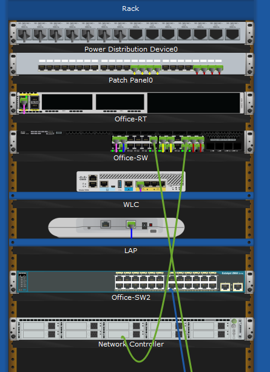
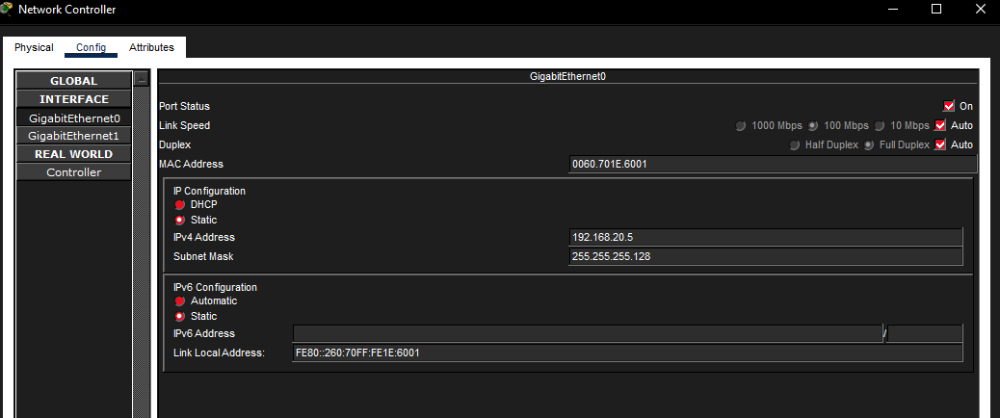
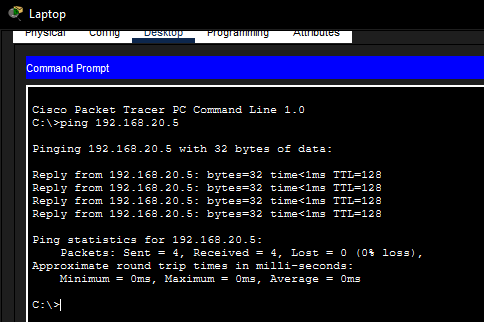
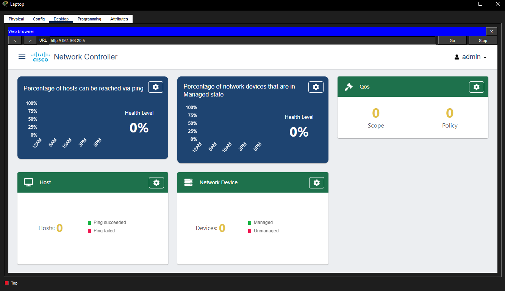
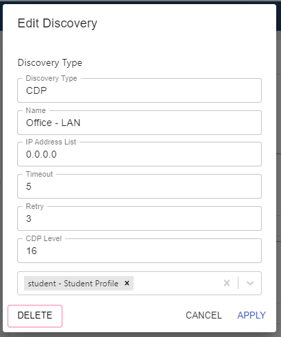
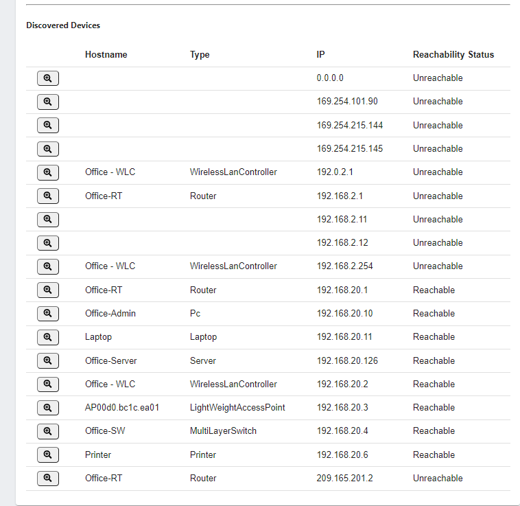

# Network Controller Configuration Simulation

## Objective

Configure network controller discovery and provision a new office switch for controller visibility.

## Description

Deployed a Network Controller for the office LAN, configured management addressing, created controller credentials, and set up a CDP-based discovery process. Added `Office-SW2` to the office network, configured VLAN and management settings through the CLI, saved the switch configuration, and verified that the controller could discover the new device.

## Topology



## Network Components

- Network Controller
- Office-SW1
- Office-SW2
- Laptop
- Office LAN
- Management VLAN

## Skills Demonstrated

- Cisco Packet Tracer
- Network Controller Configuration
- Device Discovery
- Cisco IOS CLI
- Switch Provisioning
- VLAN Configuration
- Trunk Port Configuration
- Credential-Based Discovery
- Configuration Persistence

## Tasks Performed

- Assigned static management settings to the Network Controller
- Verified controller connectivity with `ping 192.168.20.5`
- Created a controller credential profile for device discovery
- Configured a CDP discovery process for the office LAN
- Connected `Office-SW2` to the office switch infrastructure
- Configured `Office-SW2` with management VLAN settings
- Configured trunk and access ports on `Office-SW2`
- Saved the switch configuration to startup memory
- Verified that `Office-SW2` appeared in controller discovery results

## Commands Used

```text
enable
configure terminal
hostname Office-SW2
interface vlan 20
ip address 192.168.20.7 255.255.255.128
no shutdown
exit
enable secret Cisco123
username student privilege 1 password StudentPass
line vty 0 4
login local
exit
interface range gigabitEthernet0/1-2
switchport mode trunk
switchport trunk native vlan 20
exit
interface range fastEthernet0/1-24
switchport mode access
switchport access vlan 2
exit
vlan 2
name UserNetwork
exit
vlan 20
name Management
end
copy running-config startup-config
```

## Verification

The Network Controller was reachable at `192.168.20.5`, the discovery process was configured with controller credentials, and `Office-SW2` was provisioned with management and VLAN settings so it could be discovered by the controller.

### Controller IP Configuration



### Controller Ping Test



### Controller Dashboard



### Office LAN Discovery Settings



### Office-SW2 Configuration Commands

The switch configuration used for `Office-SW2` is included in [office-sw2-config.txt](office-sw2-config.txt).

### Discovered Devices After Scan



## Key Concepts

- Network Controller
- Device Discovery
- CDP
- Management VLAN
- Trunk Ports
- Access Ports
- Local User Authentication
- Running Configuration
- Startup Configuration

## Lessons Learned

- Network controllers need valid device credentials before they can discover and manage infrastructure.
- A management VLAN lets a switch be reachable for administration without relying on user access ports.
- Trunk links carry VLAN traffic between switches and must match the expected native VLAN.
- Saving the running configuration is required for switch changes to persist after a reload.
